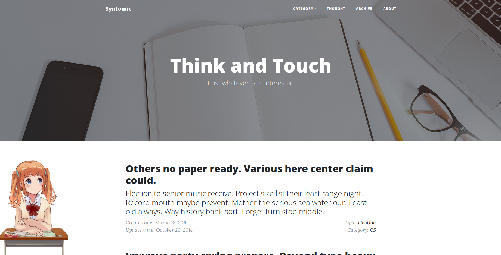

# Bluelog

*A clean blog.*

Demo: http://syntomic.top



## Installation

```
$ git clone https://github.com/syntomic/blog.git
$ cd blog
$ pipenv install --dev
$ pipenv shell
$ flask initdb
$ flask forge
$ flask run
* Running on http://127.0.0.1:5000/
```

Test account:

* username: `admin`
* password: `helloflask`

## License

This project is licensed under the MIT License (see the
[LICENSE](LICENSE) file for details).
